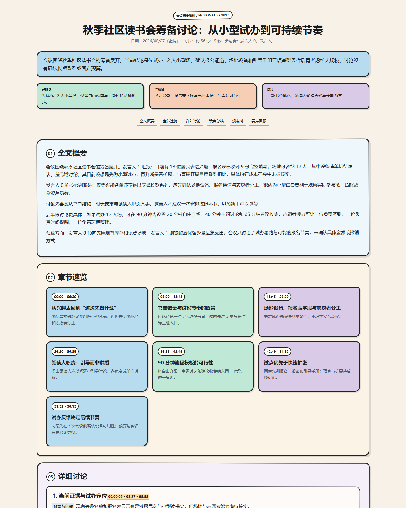

# Meeting Summary HTML

A Codex skill for turning complete meeting transcripts into grounded, readable Chinese HTML meeting briefs.

The skill is designed to:

- preserve the reasoning path, speaker positions, and timestamp anchors;
- distinguish confirmed outcomes, proposals, pending validation, risks, and open questions;
- produce a self-contained HTML document with no server, CDN, external font, or network request;
- support long-form reading, mobile layouts, and print styles.

## Preview

This is the actual rendered preview of the example HTML included in this repository:



Open the full example here:

- [Example HTML](examples/transcript-summary-sketch.html)
- [Project entry page](index.html)

## Usage

After installing this repository as a Codex skill, use:

```text
Use $summary-meeting-html to turn this transcript into a readable, self-contained HTML meeting brief.
```

The skill generates `<transcript-stem>-summary.html` and requires complete coverage of the meeting, chronological chapters, speaker summaries, a viewpoint tree, and a closing action recap.

## Repository layout

```text
.
|-- SKILL.md
|-- agents/
|   `-- openai.yaml
|-- examples/
|   `-- transcript-summary-sketch.html
|-- docs/
|   `-- preview.png
`-- index.html
```

## Note

The people, dates, numbers, and conclusions in the example page are fictional and are included only to demonstrate the structure and visual treatment.
