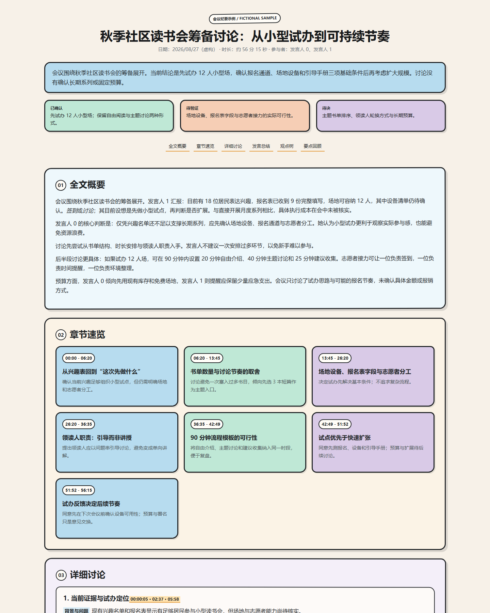

# Meeting Summary HTML

A host-neutral skill for turning a meeting transcript, text file, or local audio/video file into a grounded, self-contained HTML meeting brief. It works with Pi, Codex, Claude, or another agent with native read/write tools and, when preparation is needed, a local Python interpreter. The invoking agent performs the transcript reading, analysis, and HTML authoring in its current session; no external agent CLI or summarization model switch is required.

## What It Does

The skill routes inputs automatically:

1. Text-like inputs are read directly. No ASR call is made.
2. Audio and video inputs are sent to Alibaba Cloud Model Studio only when transcription is needed.
3. Mixed input lists are supported; only media files are transcribed.
4. The prepared transcript is passed through the original long-form HTML meeting-summary workflow.

This means users do not need to operate a separate CLI or manually decide whether Bailian is required. The CLI-compatible Python files remain as implementation helpers, but the main interface is the skill workflow.

## Supported Inputs

Text-like files:

- Markdown
- Plain text
- SRT subtitles
- VTT subtitles
- JSON transcripts

Media files:

- AAC, AMR, AVI, FLAC, FLV
- M4A, MKV, MOV, MP3, MP4, MPEG
- OGG, OPUS, WAV, WEBM, WMA, WMV

## Installation and Usage (Pi)

Copy the whole skill directory, including `SKILL.md`, `scripts/`, `references/`, and `examples/`, to either:

- User scope: `~/.pi/agent/skills/meeting-summary-html`
- Project scope: `.pi/skills/meeting-summary-html`

Run `/reload` after installation or updates. Invoke explicitly:

~~~text
/skill:meeting-summary-html <input path>
/skill:meeting-summary-html <input path> — write the HTML to <output directory>
~~~

Pi does not need Codex installed. Pi uses `SKILL.md`; `agents/openai.yaml` is optional Codex UI metadata only, not an executable or a runtime model binding. Keep manual invocation (`disable-model-invocation: true`); do not enable automatic invocation or change global configuration. The skill does not initiate delegation; it is allowed only when explicitly authorized by the user's host policy through that host's native tools/routing. Missing required tools or interpreter must be reported as concrete blockers, not worked around by switching hosts or bypassing permissions.

## Workflow

Resolve bundled scripts, references, and examples from the directory containing **the loaded SKILL.md**, not the shell working directory or a hard-coded installation path. Resolve supplied input/output paths against the invoking session's working directory before any optional directory change. Choose a user output directory (beside the input if unspecified), never the skill installation directory.

When normalization or media transcription is needed, run the bundled preparation helper:

~~~text
"<python-interpreter>" "<skill-directory>/scripts/prepare_meeting_input.py" --input "<absolute-input-path>" --output-dir "<absolute-user-output-directory>"
~~~

Substitute quoted absolute paths for these placeholders and select an available interpreter (`python3` where appropriate). Use the host shell's quoted-executable syntax; PowerShell requires a leading `&`. Repeat --input for multiple files. The helper prints a JSON manifest with the normalized transcript path, source files, detected input kinds, and whether Alibaba Cloud ASR was used. Text may instead be read directly.

The helper prepares transcripts only. Its sole existing subprocess uses `sys.executable`, the selected Python interpreter, to invoke the bundled `bailian_meeting_minutes.py` for media ASR. Its only fixed model, `qwen-audio-3.0-asr-flash-filetrans`, is for ASR, not summarization. There is no text-generation API or agent CLI call.

The current agent then reads the complete transcript and generates the HTML brief using `references/summary-meeting-html.md` resolved from the loaded skill directory. Continue with host read offsets/chunks until the entire transcript is read (Pi read output can truncate). The original visual reference is preserved at `references/transcript-summary-sketch.html`; the reference's `../examples/transcript-summary-sketch.html` link remains relative to that reference document.

Do not launch `codex exec`, `claude`, `pi`, or another external agent/LLM CLI, hard-code a summarization model/provider, or use environment detection to reconstruct the parent's session/provider. File generation remains the invoking agent's job, not the CLI helper's.

## Generated Brief Structure

The HTML output contains:

- Header and meeting metadata
- Full-meeting overview
- Chapter-at-a-glance
- Theme-based deep dive
- Speaker summaries
- Viewpoint tree
- Closing recap with confirmed outcomes, action items, risks, and unresolved questions

It also preserves timestamp anchors, mobile fallback, print styles, source grounding, and the distinction between confirmed and unconfirmed content.

## Authentication

The API key is not stored in the skill or in any source file. `scripts/bailian_meeting_minutes.py` reads it from the environment variable `DASHSCOPE_API_KEY` by default. Only media input requires this key; text-only input does not call ASR and does not need credentials. Store it in an environment variable and never commit it:

macOS/Linux:

~~~sh
export DASHSCOPE_API_KEY="your-api-key"
~~~

Windows PowerShell:

~~~powershell
$env:DASHSCOPE_API_KEY = "your-api-key"
~~~

Use --api-key-env to select another variable name. Text-only inputs do not require this variable.

## Privacy

Audio and video files are uploaded to Alibaba Cloud temporary storage for ASR. Check the provider retention and processing terms before using this skill with sensitive meetings. Text-only inputs remain local during preparation. Revoke any API key that has ever been exposed in source code or chat history.

## Development

The deterministic helper uses Python standard-library modules and is cross-platform. Run the existing offline tests from the loaded skill directory so their `scripts` imports resolve (resolve user input/output paths before changing directories):

~~~text
cd "<skill-directory>"
"<python-interpreter>" -m unittest discover -s "<skill-directory>/tests" -v
~~~

Verification checklist: resolve bundled paths from an unrelated working directory; confirm text preparation works offline without credentials; verify Python sources remain unchanged and the installed/documentation copies stay synchronized. No model or ASR endpoint call is needed for these checks.

The example page can be opened directly as `index.html`, resolved from the loaded skill directory.

## Repository Layout

~~~text
.
|-- SKILL.md
|-- agents/openai.yaml
|-- scripts/
|   |-- prepare_meeting_input.py
|   `-- bailian_meeting_minutes.py
|-- references/
|   |-- summary-meeting-html.md
|   `-- transcript-summary-sketch.html
|-- examples/transcript-summary-sketch.html
|-- docs/preview.png
`-- index.html
~~~

## License

MIT.
